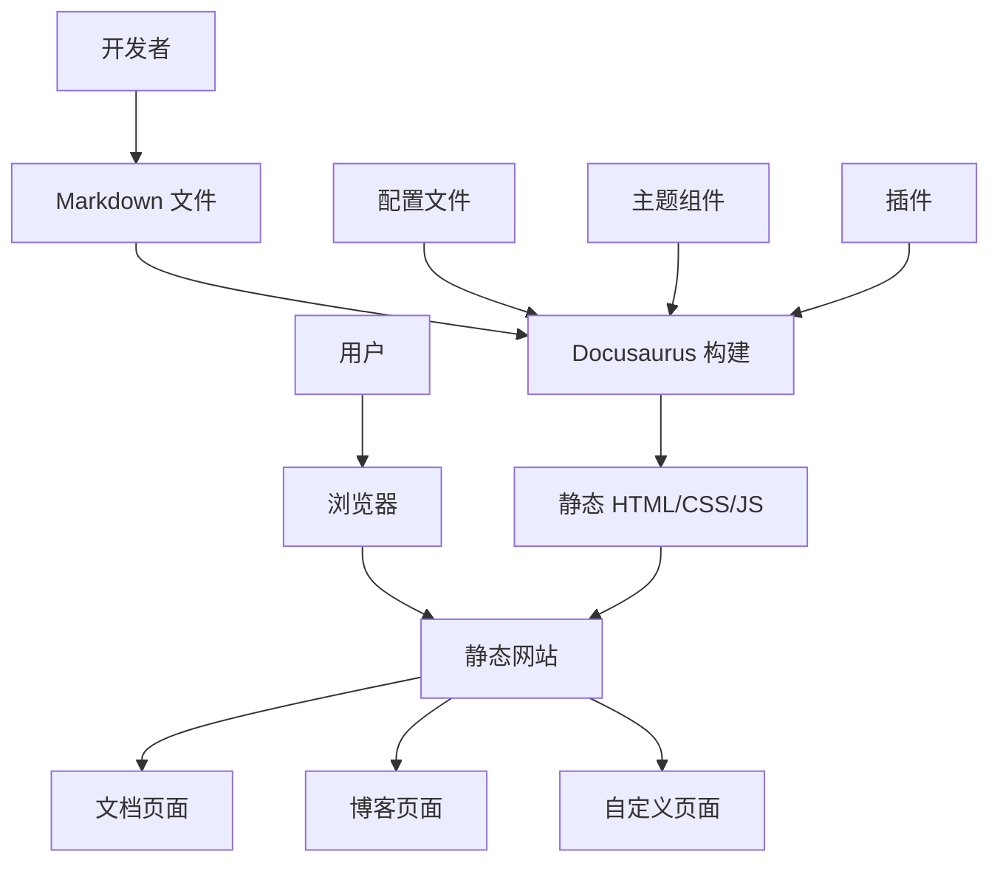
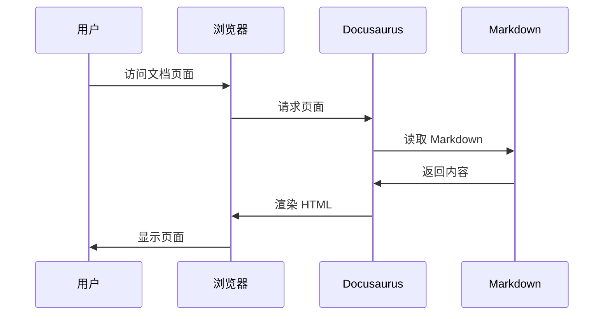
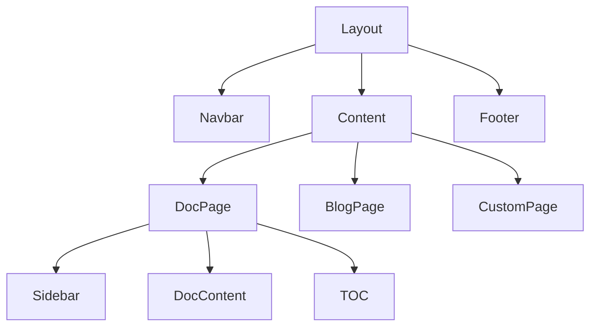
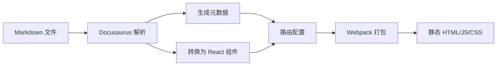
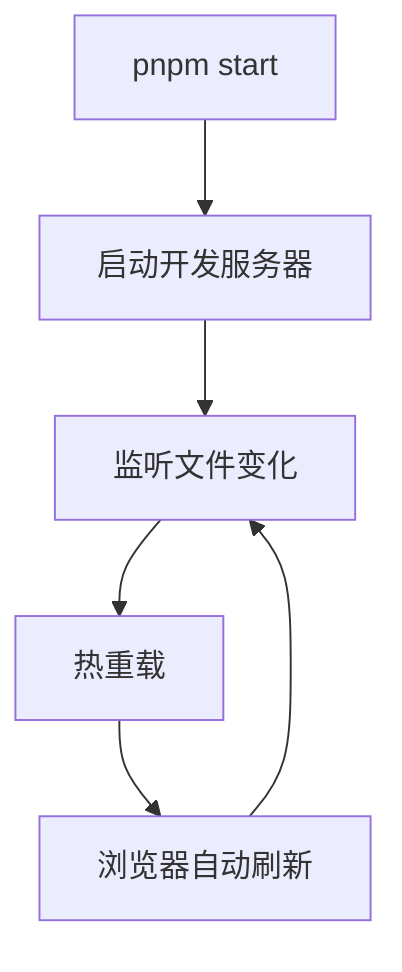
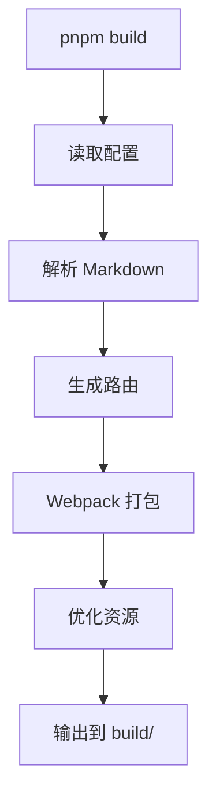

# 架构设计

本文档介绍项目的整体架构设计和技术选型。

## 技术栈

### 核心框架

- **Docusaurus 3.8.1** - 静态网站生成器
- **React 19** - UI 框架
- **MDX 3.0** - Markdown + JSX

### 构建工具

- **pnpm** - 包管理器
- **Webpack** - 模块打包器
- **Babel** - JavaScript 编译器

### 样式方案

- **CSS Modules** - 样式隔离
- **Infima** - Docusaurus 默认样式框架

## 系统架构



## 目录结构

```
project/
├── docs/                    # 文档内容
│   ├── 01-getting-started/ # 快速开始
│   ├── 02-user-guide/      # 用户指南
│   ├── 03-api/             # API 文档
│   ├── 04-deployment/      # 部署指南
│   ├── 05-development/     # 开发指南
│   └── 06-troubleshooting/ # 故障排查
│
├── blog/                    # 博客文章
│   ├── 2024-01-01-post.md
│   └── authors.yml
│
├── src/                     # 源代码
│   ├── components/         # React 组件
│   ├── css/               # 全局样式
│   └── pages/             # 自定义页面
│
├── static/                  # 静态资源
│   └── img/               # 图片资源
│
├── i18n/                    # 国际化
│   └── zh-Hans/           # 中文翻译
│
├── docusaurus.config.js    # 主配置文件
├── sidebars.js            # 侧边栏配置
└── package.json           # 依赖管理
```

## 核心组件

### 1. 文档系统

文档系统负责管理和渲染 Markdown 文档。

**特性：**
- 自动生成侧边栏
- 版本管理
- 全文搜索
- 多语言支持

**工作流程：**



### 2. 博客系统

博客系统提供时间线式的内容发布。

**特性：**
- RSS/Atom 订阅
- 作者管理
- 标签分类
- 阅读时间估算

### 3. 主题系统

主题系统控制网站的外观和交互。

**组件层次：**



### 4. 插件系统

插件扩展 Docusaurus 的功能。

**常用插件：**
- `@docusaurus/plugin-content-docs` - 文档插件
- `@docusaurus/plugin-content-blog` - 博客插件
- `@docusaurus/plugin-content-pages` - 页面插件
- `@easyops-cn/docusaurus-search-local` - 搜索插件

## 数据流



## 构建流程

### 开发模式



### 生产构建



## 性能优化

### 代码分割

Docusaurus 自动按路由进行代码分割：

```javascript
// 每个页面都是独立的 chunk
docs/intro.md → intro.chunk.js
docs/api/users.md → api-users.chunk.js
```

### 预渲染

所有页面在构建时预渲染为静态 HTML：

- 更快的首屏加载
- 更好的 SEO
- 无需服务器端渲染

### 资源优化

- 图片懒加载
- CSS/JS 压缩
- Gzip 压缩
- 浏览器缓存

## 扩展性

### 自定义组件

```jsx
// src/components/CustomButton.js
export default function CustomButton({children}) {
  return (
    <button className="custom-button">
      {children}
    </button>
  );
}
```

在 MDX 中使用：

```mdx
import CustomButton from '@site/src/components/CustomButton';

<CustomButton>点击我</CustomButton>
```

### 自定义页面

```jsx
// src/pages/custom.js
import Layout from '@theme/Layout';

export default function CustomPage() {
  return (
    <Layout title="自定义页面">
      <div>
        <h1>这是一个自定义页面</h1>
      </div>
    </Layout>
  );
}
```

### 主题定制

```javascript
// docusaurus.config.js
module.exports = {
  themeConfig: {
    colorMode: {
      defaultMode: 'light',
      disableSwitch: false,
    },
    navbar: {
      // 自定义导航栏
    },
    footer: {
      // 自定义页脚
    },
  },
};
```

## 安全考虑

### 内容安全

- Markdown 内容自动转义
- XSS 防护
- 安全的 HTML 渲染

### 依赖管理

- 定期更新依赖
- 使用 `pnpm audit` 检查漏洞
- 锁定依赖版本

## 下一步

- 查看 [贡献指南](./02-contributing.md)
- 了解 [测试指南](./03-testing.md)
